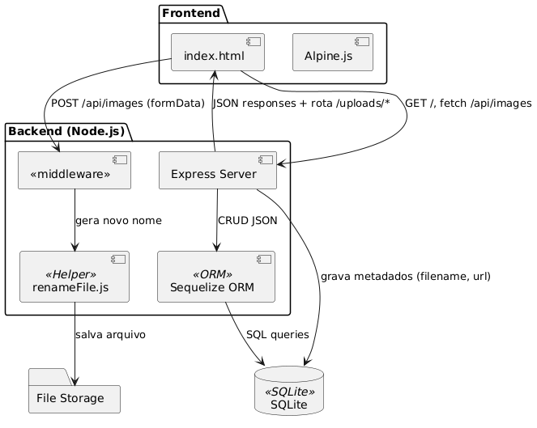

# Mini-Pinterest 🚀

> Uma “versão light” do Pinterest para você brincar de organizar e compartilhar suas imagens favoritas sem complicação.

## Autores

- **Prof. Wellington Wagner F. Sarmento** (Sistemas e Mídias Digitais, UFC)  
- **Dra. Patrícia de Sousa Paula** (Ciência da Computação, UFC)

## Sobre

Mini-Pinterest é um app didático que mostra na prática como montar um CRUD de imagens:

- **Backend**: Node.js + Express + Sequelize (SQLite)  
- **Upload**: Multer para receber e renomear arquivos  
- **Thumbs**: Sharp para gerar miniaturas  
- **Frontend**: Alpine.js para uma UI reativa sem complexidade  
- **Banco**: SQLite — leve como churrasco de domingo, mas faz o serviço!

## Requisitos Funcionais

| ID   | Título                     | Backend                                                            | Frontend                                                                | Comunicação (API)                                                         | Prioridade      |
| ---- | -------------------------- | ------------------------------------------------------------------ | ----------------------------------------------------------------------- | ------------------------------------------------------------------------- | --------------- |
| RF01 | Fazer upload de imagem     | Rota POST com Multer; renomear arquivo; salvar metadados no SQLite | Formulário de upload                                                    | `/api/images` com multipart/form-data                                     | Alta Prioridade |
| RF02 | Listar imagens             | Rota GET que busca imagens do banco                                | Galeria dinâmica com Alpine.js                                          | `/api/images`                                                             | Alta Prioridade |
| RF03 | Editar metadados           | Rota PUT que atualiza título e descrição                           | Edição inline via Alpine.js                                             | `/api/images/:id`                                                         | Alta Prioridade |
| RF04 | Excluir imagem             | Rota DELETE que remove do banco e do disco                         | Botão "remover"                                                         | `/api/images/:id`                                                         | Alta Prioridade |
| RF05 | Validar uploads            | Middleware de validação de tipo e tamanho de arquivo               | Mensagens de erro amigáveis no frontend                                 | Retorno da API com status de erro                                         | Alta Prioridade |
| RF06 | Servir arquivos estáticos  | Configuração do Express para servir `public/`                      | Carregamento dos arquivos e imagens no HTML                             | N/A (é estático, sem necessidade de chamada AJAX)                         | Alta Prioridade |
| RF07 | Autenticar usuários        | Rotas POST para cadastro/login; JWT para autenticação              | Formulários de login/cadastro; controle de sessão                       | `/api/auth/login`, `/api/auth/register`; headers com JWT                  | Alta Prioridade |
| RF08 | Paginar e filtrar imagens  | Consulta paginada e filtrada no banco; parâmetros na query         | Campo de busca e botões de paginação                                    | `/api/images?page=x&search=texto`                                         | Alta Prioridade |
| RF09 | Gerar thumbnails           | Sharp gera miniaturas ao receber a imagem                          | Exibe miniaturas na galeria                                             | Miniatura já servida como arquivo estático (`/public/uploads/thumbs/...`) | Alta Prioridade |
| RF10 | Curtir e comentar          | Rotas POST para curtir e comentar, relacionando usuário e imagem   | Botões de curtir e campo de comentário                                  | `/api/images/:id/like`, `/api/images/:id/comment`                         | Alta Prioridade |
| RF11 | Tratar erros e logs        | Middleware de erro; Winston para logs                              | Mensagens de erro amigáveis                                             | Retorno padronizado de erros HTTP                                         | Alta Prioridade |
| RF12 | Configurar via variáveis   | Leitura de `.env` para chaves, caminhos e limites                  | N/A                                                                     | N/A                                                                       | Alta Prioridade |
| RF13 | Garantir layout responsivo | N/A                                                                | Uso de CSS responsivo no `styles.css`, adaptado a mobile/tablet/desktop | N/A                                                                       | Alta Prioridade |

## Arquitetura do Sistema


> Você pode gerar essa imagem localmente com PlantUML PicoWeb Server ou [PlantUML Online](https://www.plantuml.com/plantuml).


## Estrutura de Pastas

```
mini-pinterest/
├── package.json
├── .env                # chave JWT, limites e caminhos
├── database.sqlite     # banco SQLite
├── src/
│   ├── app.js          # ponto de entrada
│   ├── config/
│   │   └── database.js # setup Sequelize/SQLite
│   ├── models/
│   │   ├── Image.js
│   │   ├── User.js
│   │   └── ...
│   ├── routes/
│   │   ├── images.js
│   │   ├── auth.js
│   │   └── ...
│   └── utils/
│       ├── renameFile.js
│       └── logger.js
└── public/
    ├── index.html
    ├── css/
    │   └── styles.css
    └── uploads/
        ├── thumbs/
        └── full/
```


## Tecnologias

* **Node.js** + **Express**
* **Sequelize** (SQLite)
* **Multer** (upload) + **Sharp** (thumbnails)
* **Alpine.js** (UI reativa)
* **dotenv**, **helmet**, **express-rate-limit**, **winston**
* **Jest** + **Supertest** (testes)


## Pré-requisitos

* **Node.js** ≥ 14
* **npm** ≥ 6 ou **yarn**


## Instalação & Uso

1. Clone o repo

   ```bash
   git clone https://github.com/wwagner33/mini-pinterest.git
   cd mini-pinterest
   ```
2. Instale dependências

   ```bash
   npm install
   ```
3. Crie um `.env` baseado no `.env.example`
4. Execute em modo dev

   ```bash
   npm run dev
   ```
5. Abra no browser

   ```bash
   http://localhost:3000
   ```

---

## Contribuição

1. Faça um fork
2. Crie uma branch (`git checkout -b feature/x`)
3. Commit suas alterações (`git commit -m "feat: descrição"`)
4. Push na branch (`git push origin feature/x`)
5. Abra um Pull Request e espere o café esfriar ☕

---

## Licença

Este projeto está sob a [GNU GPLv3](LICENSE). Faça bom uso e compartilhe sorrisos! 😄
